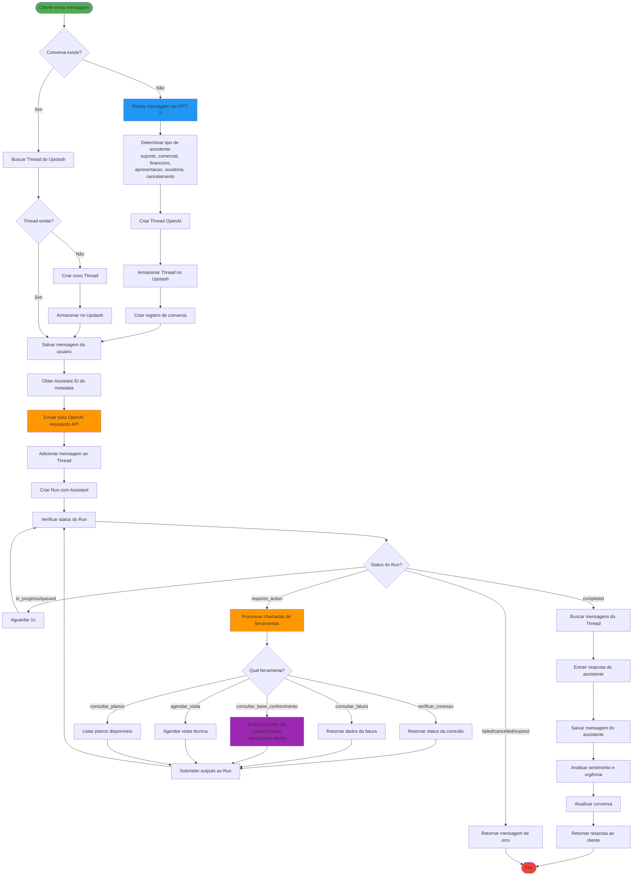
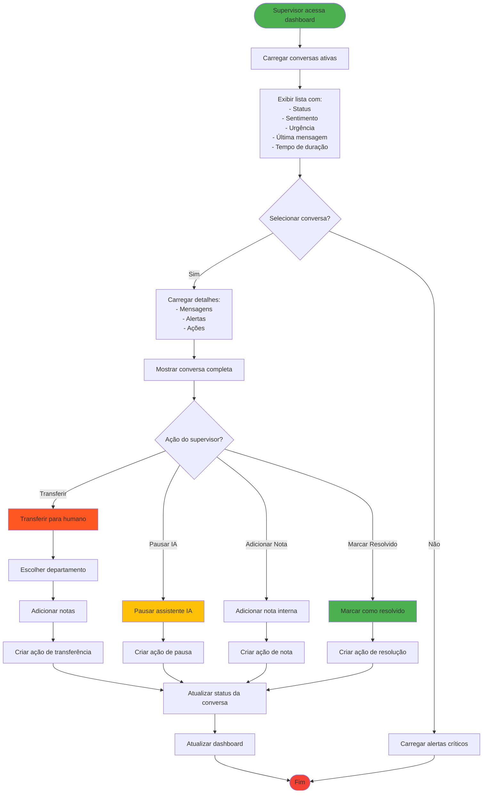

# Fluxograma da Plataforma TR Chat

## Visão Geral do Sistema



## Fluxo de Monitoramento (Dashboard Supervisor)



## Componentes do Sistema

### 1. **Frontend (React + Vite)**
- **TestChat**: Interface de teste de chat
- **Monitor**: Dashboard de monitoramento
- **ConversationDetails**: Detalhes de conversas

### 2. **Backend (Express)**
- **Routes**: Endpoints da API
- **Storage**: Armazenamento em memória
- **OpenAI Integration**: Integração com Assistants API

### 3. **Serviços Externos**

#### OpenAI
- **GPT-5**: Roteamento de mensagens
- **Assistants API**: Processamento de conversas
- **Threads**: Contexto de conversas
- **Function Calling**: Execução de ferramentas

#### Upstash
- **Redis**: Armazenamento de threads (chat_id → thread_id)
- **Vector**: Base de conhecimento para RAG

### 4. **Assistentes Especializados**

| Assistente | Função | Triggers |
|-----------|--------|----------|
| **suporte** | Problemas técnicos | internet lenta, sem conexão, equipamentos |
| **comercial** | Vendas e planos | contratar plano, upgrade, preços |
| **financeiro** | Faturas e pagamentos | fatura, boleto, pagamento |
| **apresentacao** | Novos clientes | apresentação, conhecer empresa |
| **ouvidoria** | Reclamações | reclamação, SAC, insatisfeito |
| **cancelamento** | Cancelar serviço | cancelar, desistir |

### 5. **Ferramentas dos Assistentes**

1. **verificar_conexao**: Status de conexão, velocidade, latência
2. **consultar_fatura**: Dados de fatura, vencimento, código de barras
3. **consultar_base_conhecimento**: RAG com Upstash Vector
4. **agendar_visita**: Agendar visita técnica
5. **consultar_planos**: Listar planos disponíveis

## Fluxo de Dados

```
Cliente → Frontend → Backend → OpenAI → Ferramentas → Upstash
                        ↓                      ↓
                    Storage              Base de Conhecimento
                        ↓                      ↓
                    Monitor ← ← ← ← ← ← ← ← ← ←
```

## Sistema de Alertas

O sistema monitora automaticamente:
- **Sentimento negativo**: Gera alerta de insatisfação
- **Urgência crítica**: Mensagens com "URGENTE" ou "!!!"
- **Tempo de resposta**: Conversas longas sem resolução
- **Padrões de problema**: Problemas recorrentes

## Ações do Supervisor

1. **Transferir para Humano**: Move conversa para atendimento humano
2. **Pausar IA**: Interrompe respostas automáticas
3. **Adicionar Nota**: Registra observações internas
4. **Marcar Resolvido**: Finaliza conversa
